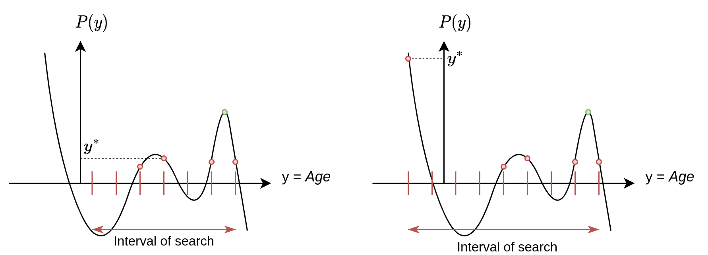

# single-cell-methylation-fake

This repository provides a set of evidences that the original procedure proposed in [Trapp et al.](https://www.nature.com/articles/s43587-021-00134-3) for inference epigenetic age in single cell methylation data contains mistakes and generates wrong results. I specifically considered one of the most strange results which is called "ground zero", i.e. achieving the global minimum in epigenetic age during embryogenesis. I show that the ground zero is actually an artifact of the inherently wrong procedure of maximum likelihood estimation (MLE) proposed by the authors. In short, authors proposed to find polynomial likelihood function by applying brute force algorithm manually defined interval of search while the global solution can be found. I show the global solution for MLE problem provides other results than the authors proposed in their paper. The concrete procedure is provided in the notebook `proof`.

# Mathematical formulation

Problem of **single cell** age inference is reduced to the maximum likelihood estimation problem, namely:

$$ y^* = \underset{y}{\operatorname{\argmax}} \prod_{i=1}^n p_i(y) \tag{1}$$

where $y$ - sought cell age and $y^*$ - optimal cell age correspondingy; $p_i(y)$ - probability of $i$-th CpG site to be methylated; $n$ - total number of sites. Authors proposed to use a concrete functional form for the probabilities:

$$ p_i(y) = p_i(y|b_i, w_i) = w_{i}y + b_i \tag{2}$$

the weight $w_i$ and bias $b_i$ are taken from a reference bulk dataset. Importantly these weights and biases are not the result of ElasticNet model fitting to predict age but Linear Regression model was fitted for each site separately. Specifically, for each $i$-th methylation site having methylation value $x_i \in [0,1]$ the following problem was solved:

$$ w_i,b_i = \underset{w, b}{\operatorname{\argmin}} ||x_i - wy - b||_2$$

Thus, weights and biases, obtained after multiple regression models fitting on bulk dataset, were applied to predict cell age in the single cell dataset. Combining the equations (1) and (2) have:

$$ y^* = \underset{y}{\operatorname{\argmax}} \prod_{i=1}^n (w_{i}y + b_i) \tag{3}$$

The objective (3) is not a whole procedure of cell age inference. Two problems have to be resolved before: 
1. Probability values are not bounded in the proposed linear function approximation;
2. The probabilites are not conditioned by the concrete single cell methylation profile.

For the first problem authors proposed to bound a linear function by a manually predetermined constants, e.g.:
\begin{equation*}
    \begin{align*} 
        if\ p \geq 1 \rightarrow p = 1 - \epsilon \\
        if\ p \leq 0 \rightarrow p = \epsilon 
    \end{align*}
\end{equation*}
where $\epsilon$ is small constant typically equal to $0.001$. It worth to say that such bounding do not preserve the property of PDF to be integrated in $1$ across support. This bounding also generates one additional **problem** with the whole procedure which we discuss below in details within this notebook.

For the second problem authors proposed to use the following conditioning on single cell methylation profile for the probabilities by modifying equation (2):

$$ p_i(y) = p_i(y|b_i, w_i, CpG_i) = p_i^{CpG_i}(1-p_i)^{1-CpG_i} = 
\begin{bmatrix}
w_{i}y + b_i, |\ CpG_i = 1 \\
-w_{i}y + (1-b_i), |\  CpG_i = 0
\end{bmatrix} 
\tag{4}$$

where $CpG_i$ can take values from ${0, 1}$ based on the actual observation of single cell methylation data. The idea of the preconditionin is just to consider a probability of inverse event if zero value of methylation was observed in data. By substitution the expression (4) to the objective (1) one can observe that for each concrete cell the problem is reduced to the finding a maximum of polynomial function on the interval:

$$ y^* = \underset{y\in [y_{min}, y_{max}]}{\operatorname{\argmax}} \prod_{i=1}^n p_i(y|CpG) = 
        (w_{1}y + b_1)(-w_{2}y + (1-b_2))\cdots (w_{n}y + b_n); for\ CpG = [1,0,...1]
\tag{5}$$

Authors solve this problem by brute force approach, i.e. they split the interval of search ($[y_{min}, y_{max}]$) into $K$ number of ages and estimate the likelihood function in each point of the grid. This approach might be robust in case you have 1-5 CpG cites but in reality this generates the second main **problem** of the whole procedure which, I argue, leads to the wrong coclusion about **ground zero** existence.

Below I propose to consider the corrected procedure which avoids splitting the interval of search into K uniformly distributed values. Instead, I find global maximum of likelihood function on the interval by definition using nice properties of polynomial function. Moreover, I show that procedure of bounding probabilities leads to wrong results in case we expand the interval of search to the negative ages (what was done in the original paper) - I show how we can define this interval automatically based on the properties of monomials of polynomial function.

# Acknowledgements
I want to thank Evgeny Efimov for data collection and preprocessing.

# Cite
For now just put the link to this repo :3

